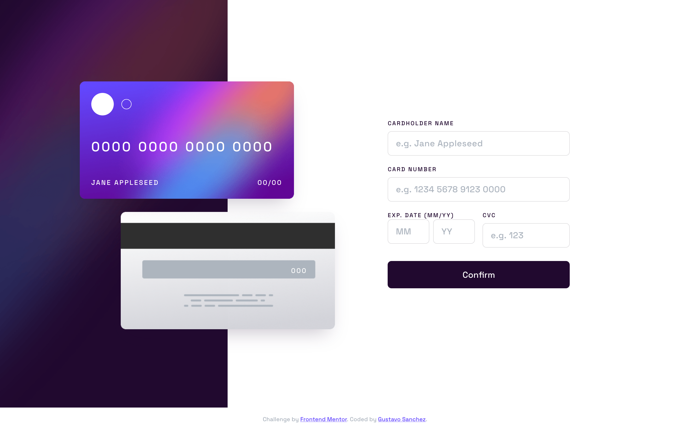
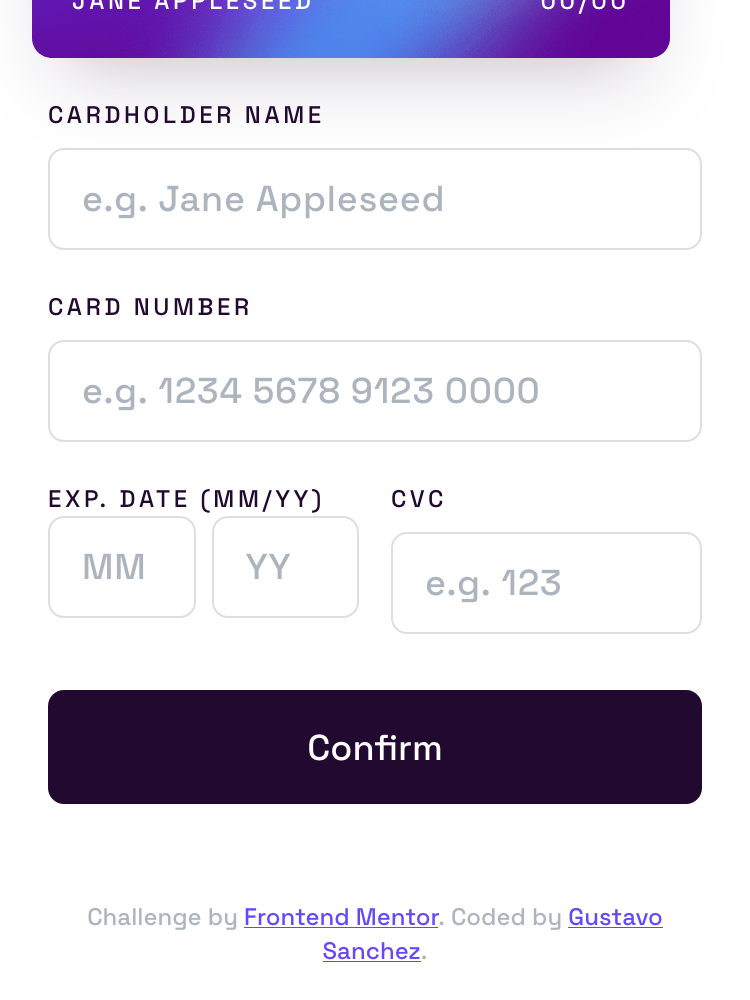

# Frontend Mentor - Interactive card details form solution

This is a solution to the [Interactive card details form challenge on Frontend Mentor](https://www.frontendmentor.io/challenges/interactive-card-details-form-XpS8cKZDWw). Frontend Mentor challenges help you improve your coding skills by building realistic projects.

## Table of contents

- [Overview](#overview)
  - [The challenge](#the-challenge)
  - [Screenshots](#screenshots)
  - [Links](#links)
- [My process](#my-process)
  - [Built with](#built-with)
  - [What I learned](#what-i-learned)
  - [Continued development](#continued-development)
- [Author](#author)

## Overview

### The challenge

Users should be able to:

- Fill in the form and see the card details update in real-time
- Receive error messages when the form is submitted if:
  - Any input field is empty
  - The card number, expiry date, or CVC fields are in the wrong format
- View the optimal layout depending on their device's screen size
- See hover, active, and focus states for interactive elements on the page

### Screenshots

**Desktop (1440px)**



**Mobile (375px)**



### Links

- Solution URL: _coming soon_
- Live Site URL: _coming soon_

## My process

### Built with

- Semantic HTML5 markup
- CSS custom properties (design tokens for colors, gradients, typography, spacing)
- Flexbox & CSS Grid
- Mobile-first responsive design
- Vanilla JavaScript (ES modules)
- [Vite](https://vitejs.dev/) — dev server and build tool
- [Space Grotesk](https://fonts.google.com/specimen/Space+Grotesk) — via Google Fonts

### What I learned

- Using a **gradient border** on focused inputs with the CSS double-background trick (`background-origin: border-box` + `background-clip: padding-box, border-box`).
- Coordinating an **absolutely positioned card** that overflows its panel into the next section — without `overflow: hidden` cropping it.
- Live-updating a preview by binding plain `input` events to `data-preview` targets, keeping DOM updates colocated with formatters.

```js
cardnumber.addEventListener('input', (e) => {
  const formatted = formatCardNumber(e.target.value);
  e.target.value = formatted;
  preview('number').textContent = formatted || DEFAULTS.number;
});
```

### Continued development

- Add unit tests for `formatters.js` and `validators.js`.
- Improve focus management when the success state appears (move focus to the heading).
- Add reduced-motion / prefers-color-scheme variants.

## Author

[](https://www.linkedin.com/in/gustavosanchezgalarza/) [](https://github.com/gusanchefullstack) [](https://hashnode.com/@gusanchedev) [](https://x.com/gusanchedev) [](https://bsky.app/profile/gusanchedev.bsky.social) [](https://www.freecodecamp.org/gusanchedev) [](https://www.frontendmentor.io/profile/gusanchefullstack)
